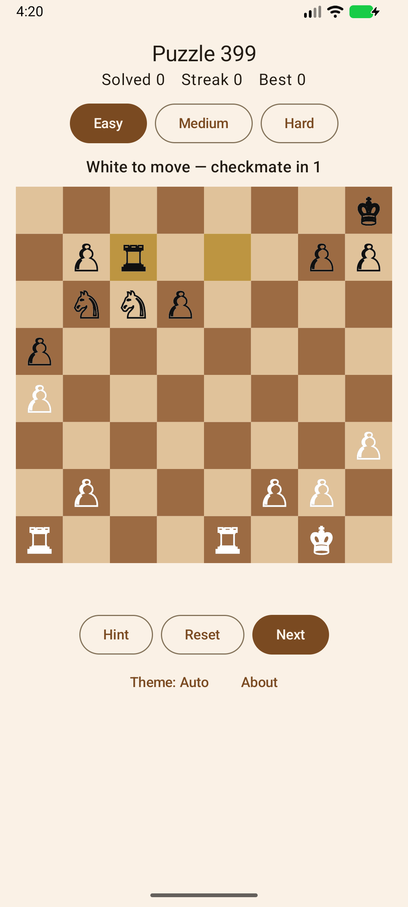
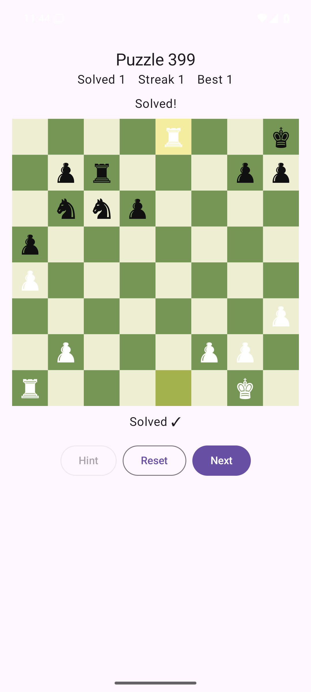

# Chess Puzzles

[](https://github.com/cocodedk/chess-puzzles/actions/workflows/ci.yml)
[](LICENSE)

An Android chess **puzzle** game — Kotlin + Jetpack Compose, built and run entirely from the command
line (no Android Studio). Solve tactical puzzles from the Lichess database: find the best move, the
opponent replies automatically, and your solved count / streak are saved on-device.

 

_Running on a headless Android 15 emulator (left: a puzzle; right: solved, with progress saved)._

## Website

- [English](https://cocodedk.github.io/chess-puzzles/)
- [فارسی (Persian)](https://cocodedk.github.io/chess-puzzles/fa/)

## Download

[**Download Chess Puzzles (APK)**](https://github.com/cocodedk/chess-puzzles/releases/latest/download/ChessPuzzles.apk)
— Android 7.0+, signed release. The link is live once the first release is cut (Actions →
**Release APK** → Run workflow).

## Quickstart

```bash
source ~/.chess-env.sh                 # JAVA_HOME / ANDROID_HOME / PATH (see docs/SETUP.md)
./gradlew koverVerify                   # run all tests + the 100% coverage gate
./gradlew assembleDebug                 # build app/build/outputs/apk/debug/app-debug.apk
bash scripts/emu.sh                      # boot a headless emulator, install, screenshot -> docs/screenshot.png
```

## Modules

- **`:core`** — pure Kotlin/JVM: chess rules (via [chesslib](https://github.com/bhlangonijr/chesslib)),
  the `PuzzleSession` state machine, and CSV parsing. No Android dependencies; fully unit-tested.
- **`:app`** — Android UI: a Compose `Canvas` board (tap + drag), `PuzzleViewModel`, and DataStore
  persistence.

## Docs

- [`docs/PLAN.md`](docs/PLAN.md) — overview, decisions, status
- [`docs/SETUP.md`](docs/SETUP.md) — toolchain, build, and emulator commands
- [`docs/ARCHITECTURE.md`](docs/ARCHITECTURE.md) — modules, the `:core` contract, testing approach
- [`docs/DATA.md`](docs/DATA.md) — puzzle pipeline and attribution

## Engineering rules

See [`CLAUDE.md`](CLAUDE.md): 200-line file cap, `/simplify` + `/code-review` before every commit, a
pre-push test+coverage hook, and 100% test coverage (enforced by Kover; `@Composable` functions are
excluded as their compiler-generated recomposition branches are unreachable by tests).

## Credits

Puzzles: [Lichess Open Database](https://database.lichess.org) (CC0 1.0). Chess engine:
chesslib (Apache-2.0).

## Author

**Babak Bandpey** — [cocode.dk](https://cocode.dk) | [LinkedIn](https://linkedin.com/in/babakbandpey) | [GitHub](https://github.com/cocodedk)

## License

Apache-2.0 | © 2026 [Cocode](https://cocode.dk) | Created by [Babak Bandpey](https://linkedin.com/in/babakbandpey)
