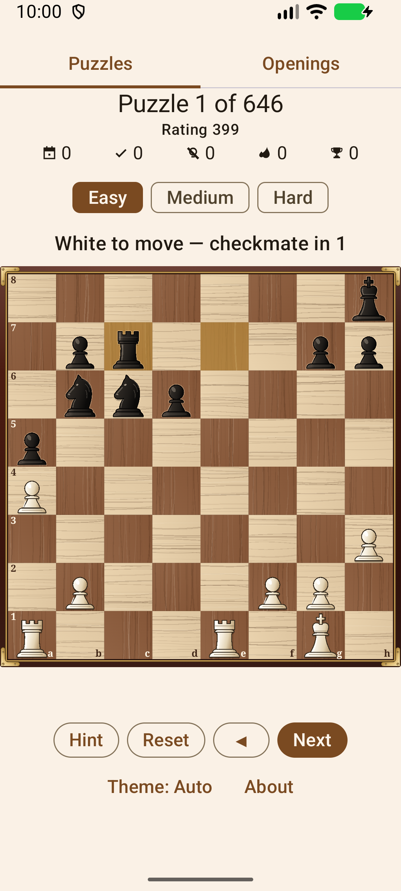
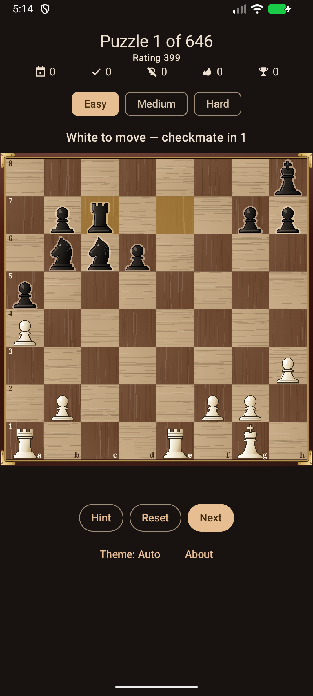
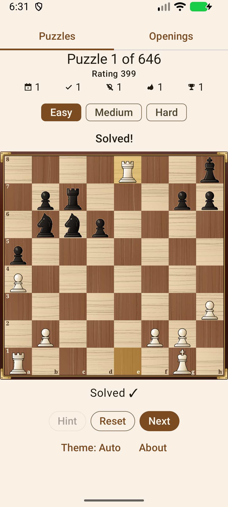
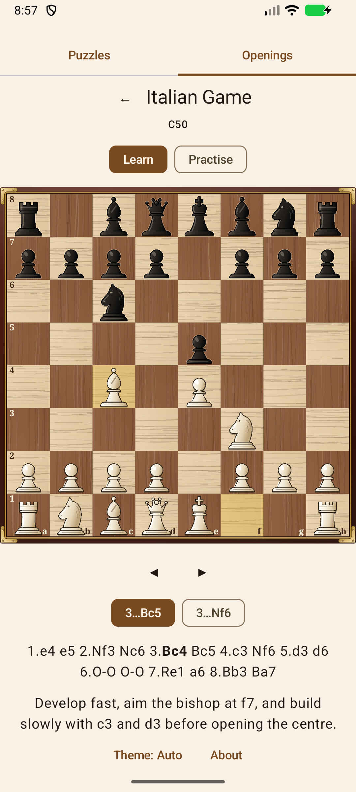

# Chess Puzzles

[](https://github.com/cocodedk/chess-puzzles/actions/workflows/ci.yml)
[](LICENSE)

An Android chess **puzzle** game — Kotlin + Jetpack Compose, built and run entirely from the command
line (no Android Studio). Solve Lichess tactical puzzles with announced goals (e.g. "checkmate in 2"),
difficulty bands (Easy/Medium/Hard), day/night themes, and saved progress on-device.

## Download

<!-- cocode-apps:install:start -->
[](https://f-droid.org/packages/dk.cocode.chess/)
- [Download the Android installation file (APK) from GitHub](https://github.com/cocodedk/chess-puzzles/releases/latest/download/ChessPuzzles.apk)
- [Add the app to Obtainium, an app that keeps it up to date](https://apps.obtainium.imranr.dev/redirect?r=obtainium://add/https://github.com/cocodedk/chess-puzzles)
<!-- cocode-apps:install:end -->

Android 7.0+, signed release.

   

_From left to right: light mode, night mode, a solved puzzle, and opening practice._

## Website

- [English](https://chess.cocode.dk/)
- [Dansk (Danish)](https://chess.cocode.dk/da/)
- [فارسی (Persian)](https://chess.cocode.dk/fa/)

## Features

- **Real Lichess puzzles.** Tactics from the Lichess Open Database (CC0 1.0), bundled with the app.
- **Announced goals.** Each puzzle says what to find, such as "checkmate in 2" or "gain a winning
  advantage". Find each move of the solution; the opponent replies automatically after each one.
- **Three difficulty bands.** Easy, Medium or Hard, with hints when you want a nudge.
- **Opening practice.** Twenty openings, learned move by move and then practised from memory.
- **Saved progress.** Your solved count, puzzles solved without a hint, streaks and day streak are saved on your device.
- **Light and dark themes.** Matches your phone's setting, or switch to Light or Dark with the theme button.
- **Tap or drag.** Move pieces by tapping their starting and destination squares, or by dragging them.
- **Fully offline and free.** No account, no ads, no tracking. Apache-2.0.

## Privacy

Chess Puzzles collects, sends and shares no personal data. It never asks you for a permission and has no
internet permission, so the app itself cannot connect to anything. It has no account, ads, analytics or
tracking. The About screen's buttons open web pages in your browser, and only when you tap them. Your
progress stays on your device, apart from Android's own backup: if you have Auto Backup or Google account backup turned on, the system
may include the app's local data in your own Google backup, which we have no access to. Read the full
[privacy policy](https://chess.cocode.dk/privacy/).

## Build

```bash
source ~/.chess-env.sh                 # JAVA_HOME / ANDROID_HOME / PATH (see docs/SETUP.md)
./gradlew koverVerify                   # run all tests + the 100% coverage gate
./gradlew assembleDebug                 # build app/build/outputs/apk/debug/app-debug.apk
bash scripts/emu.sh                      # boot a headless emulator, install, screenshot -> docs/screenshot.png
```

## Modules

- **`:core`** — pure Kotlin/JVM: chess rules (via [chesslib](https://github.com/bhlangonijr/chesslib)),
  the `PuzzleSession` state machine, and CSV parsing. No Android dependencies; fully unit-tested.
- **`:app`** — Android UI: a Compose `Canvas` board (tap + drag), `PuzzleViewModel`, and DataStore
  persistence.

## Docs

- [`docs/PLAN.md`](docs/PLAN.md) — overview, decisions, status
- [`docs/SETUP.md`](docs/SETUP.md) — toolchain, build, and emulator commands
- [`docs/ARCHITECTURE.md`](docs/ARCHITECTURE.md) — modules, the `:core` contract, testing approach
- [`docs/DATA.md`](docs/DATA.md) — puzzle pipeline and attribution

## Contributing

Issues and pull requests are welcome; see [CONTRIBUTING.md](CONTRIBUTING.md) for setup, the git hooks
and the pull request checklist.

The engineering rules are in [`CLAUDE.md`](CLAUDE.md): 200-line file cap, `/simplify` + `/code-review` before every commit, a
pre-push test+coverage hook, and 100% line coverage (enforced by Kover; `@Composable` functions are
excluded as their compiler-generated recomposition branches are unreachable by tests).

## Credits

Puzzles: [Lichess Open Database](https://database.lichess.org) (CC0 1.0). Chess rules:
chesslib (Apache-2.0).

## Author

**Babak Bandpey** — [cocode.dk](https://cocode.dk) | [LinkedIn](https://linkedin.com/in/babakbandpey) | [GitHub](https://github.com/cocodedk)

## License

Apache-2.0 | © 2026 [Cocode](https://cocode.dk) | Created by [Babak Bandpey](https://linkedin.com/in/babakbandpey)
